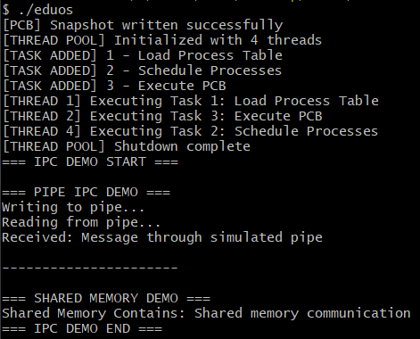
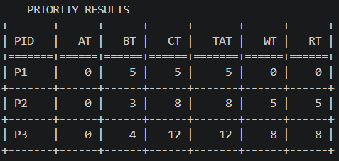
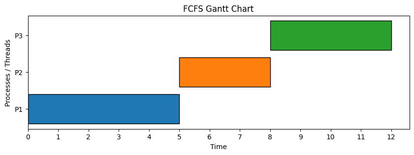

# EDUOS – Operating System Simulation Project

---

## Project Title
**EDUOS – Operating System Simulation (C & Python)**

## Module Code
351 CS 2104 

## Student Information
- **Name:** Shadreck Nkhope  
- **Registration Number:** 25311351019

---

# Overview

EDUOS is a simplified operating system simulation project developed for CS & IT coursework.  
It demonstrates core operating system concepts including:

- Process Management (PCB simulation)
- Thread Management
- Inter-Process Communication (IPC)
- CPU Scheduling Algorithms (FCFS, SJF, Priority, Round Robin)
- Python-based Scheduling Analysis and Visualization

The project consists of:

- **C Core System** → Low-level OS simulation
- **Python Scheduler** → Analysis + visualization layer

---

# Project Structure

```text
EDUos/
│
├── c_core/
│   ├── main_sim.c
│   ├── process_manager.c
│   ├── thread_manager.c
│   ├── ipc_module.c
│   ├── makefile
│   ├── include/
│   │   └── eduos.h
│   └── eduos.exe
│
├── python_scheduler/
│   ├── scheduler_sim.py
│   ├── sample_processes.csv
│   ├── pcb_snapshot.json
│   ├── requirements.txt
│   └── __pycache__/
│
├── docs/
│   └── screenshots/
│
├── README.md
└── .gitignore
```

---

# Prerequisites

## C Core Requirements

- GCC compiler (MinGW / MSYS2 / WSL recommended)
- pthread support
- Windows users: MSYS2 UCRT64 recommended

### Check GCC:
```bash
gcc --version
```

### Python Requirements

- Python 3.8+
- pip package manager

## Install dependencies:

```bash
pip install -r requirements.txt
```

## Build Instructions

### Step 1: Clone Repository
```bash
git clone https://github.com/your-username/eduos.git
cd EDUos
```

### Step 2: Build C Core
```bash
gcc -Wall -Wextra -pthread -std=c11 \
main_sim.c process_manager.c thread_manager.c ipc_module.c scheduler.c \
-o eduos
```
#### Run:
```bash
./eduos
```

### Windows:
```bash
eduos.exe
```

### Step 3: Run Python Scheduler
```bash
cd python_scheduler
pip install -r requirements.txt
python scheduler_sim.py
```
---
## Features Implemented
1.  Process Management
    - PCB creation and lifecycle tracking
    - Process state transitions (READY → RUNNING → TERMINATED)
2. Thread Management
    - Thread pool simulation
    - Concurrent execution model
3. IPC System
    - Message queue simulation
    - Inter-process communication handling
4. CPU Scheduling
    - FCFS
    - SJF
    - Priority Scheduling (with aging)
    - Round Robin
5. Python Analysis
    - Gantt chart visualization
    - Performance metrics (WT, TAT, RT)
    - CSV → JSON pipeline
---
## Screenshots (Evidence)
### C_core execution



### Python_scheduler output



### Gantt chart




## Final Output
```text
0 errors from 0 contexts
```

Clean compilation using:
```bash
gcc -Wall -Wextra -pthread -std=c11
```

## Challenges & Solutions
1. Multiple main() Conflict
    - Problem: Multiple entry points in different C files
    - Fix: Compiled only main_sim.c for main system
2. Windows Valgrind Limitation
    - Problem: Valgrind not available on Windows
    - Fix: Used MSYS2/WSL or documented limitation
3. Thread Synchronization Issues
    - Problem: Race conditions in scheduling
    - Fix: Added mutex-based fixed version
4. IPC Failures
    - Problem: Pipe/message errors
    - Fix: Added proper error handling and validation
5. Build System Issues
    - Problem: Wildcard compilation caused linking errors
    - Fix: Explicit source file compilation

---
## References
- Silberschatz, Galvin & Gagne – Operating System Concepts
- Stallings – Operating Systems: Internals and Design Principles
- GCC Documentation: https://gcc.gnu.org/onlinedocs/
- POSIX Threads: https://man7.org/linux/
- Python Docs: https://docs.python.org/3/
- MSYS2 Documentation: https://www.msys2.org/
- 351 CS 2104 Lecture Notes
